# KAMRAN Translate

<div align="center">

# KAMRAN Translate

### A Multimodal Uyghur ↔ Chinese Translation Companion for Text, Voice, Camera, Learning, and Offline-Ready Language Workflows

[](https://expo.dev/)
[](https://reactnative.dev/)
[](https://react.dev/)
[](https://www.typescriptlang.org/)
[](https://docs.expo.dev/router/introduction/)
[](https://trpc.io/)
[](https://orm.drizzle.team/)
[](https://vitest.dev/)
[](https://www.typescriptlang.org/)

**KAMRAN Translate** is a mobile-first multilingual communication companion designed around Uyghur ↔ Chinese translation, multimodal input, language learning, phrase retention, speech interaction, camera-based workflows, and an extensible language intelligence architecture.


</div>

---

# Table of Contents

- [1. Project Overview](#1-project-overview)
- [2. Why KAMRAN Exists](#2-why-kamran-exists)
- [3. Product Vision](#3-product-vision)
- [4. Core Capabilities](#4-core-capabilities)
- [5. Supported User Experiences](#5-supported-user-experiences)
- [6. System Architecture](#6-system-architecture)
- [7. High-Level Architecture](#7-high-level-architecture)
- [8. Mobile Application Architecture](#8-mobile-application-architecture)
- [9. Backend Architecture](#9-backend-architecture)
- [10. Translation Architecture](#10-translation-architecture)
- [11. Text Translation](#11-text-translation)
- [12. Voice Translation](#12-voice-translation)
- [13. Camera and OCR](#13-camera-and-ocr)
- [14. Translation History](#14-translation-history)
- [15. Phrasebook](#15-phrasebook)
- [16. Learning Architecture](#16-learning-architecture)
- [17. Dialect Architecture](#17-dialect-architecture)
- [18. RTL and Internationalization](#18-rtl-and-internationalization)
- [19. Accessibility](#19-accessibility)
- [20. Design System](#20-design-system)
- [21. Navigation Architecture](#21-navigation-architecture)
- [22. State Management](#22-state-management)
- [23. Data Model](#23-data-model)
- [24. API Architecture](#24-api-architecture)
- [25. Async Processing](#25-async-processing)
- [26. Offline Architecture](#26-offline-architecture)
- [27. Security and Privacy](#27-security-and-privacy)
- [28. Environment Configuration](#28-environment-configuration)
- [29. Installation](#29-installation)
- [30. Local Development](#30-local-development)
- [31. Running the Application](#31-running-the-application)
- [32. Testing](#32-testing)
- [33. Type Safety](#33-type-safety)
- [34. Linting and Formatting](#34-linting-and-formatting)
- [35. Database Development](#35-database-development)
- [36. Production Build Architecture](#36-production-build-architecture)
- [37. EAS Deployment](#37-eas-deployment)
- [38. Release Engineering](#38-release-engineering)
- [39. Repository Structure](#39-repository-structure)
- [40. Frontend Architecture](#40-frontend-architecture)
- [41. Backend Engineering](#41-backend-engineering)
- [42. Translation Quality](#42-translation-quality)
- [43. AI Architecture](#43-ai-architecture)
- [44. Performance Engineering](#44-performance-engineering)
- [45. Observability](#45-observability)
- [46. Error Handling](#46-error-handling)
- [47. User Journey](#47-user-journey)
- [48. State Machines](#48-state-machines)
- [49. Sequence Diagrams](#49-sequence-diagrams)
- [50. Technical Decisions](#50-technical-decisions)
- [51. Development Roadmap](#51-development-roadmap)
- [52. Contribution Guide](#52-contribution-guide)
- [53. Engineering Standards](#53-engineering-standards)
- [54. Future Features](#54-future-features)
- [55. Example Workflows](#55-example-workflows)
- [56. Troubleshooting](#56-troubleshooting)
- [57. FAQ](#57-faq)
- [58. Project Philosophy](#58-project-philosophy)
- [59. Complete Architecture Diagram](#59-complete-architecture-diagram)
- [60. Final Summary](#60-final-summary)

---

# 1. Project Overview

KAMRAN Translate is a cross-platform language application focused on making Uyghur ↔ Chinese communication easier through a combination of translation, multimodal input, language learning, persistent phrase storage, speech interaction, and camera-based workflows.

Instead of treating translation as a single API operation, KAMRAN treats translation as part of a larger communication lifecycle.

The core lifecycle is:

```text
Discover
   ↓
Enter
   ↓
Translate
   ↓
Understand
   ↓
Save
   ↓
Practice
   ↓
Reuse
   ↓
Communicate
````

The project is designed around a modern TypeScript architecture with an Expo-powered React Native client, reusable UI components, typed service boundaries, server-side APIs, persistent data access, and future-ready hooks for AI and language intelligence.

---

# 2. Why KAMRAN Exists

Translation applications often reduce the user journey to:

```text
Input
   ↓
Translation API
   ↓
Output
```

This model is useful, but incomplete.

A real communication scenario often looks like:

```text
User sees unfamiliar text
        ↓
Attempts to understand it
        ↓
Uses camera or manual input
        ↓
Translates content
        ↓
Listens to pronunciation
        ↓
Saves useful phrase
        ↓
Practices phrase later
        ↓
Uses phrase in conversation
```

KAMRAN is architected around this larger workflow.

The product therefore treats translation as a foundation for:

* communication
* learning
* phrase retention
* pronunciation
* history
* multimodal interaction
* contextual assistance
* language discovery

---

# 3. Product Vision

## Vision

Build an accessible and extensible communication platform for Uyghur ↔ Chinese language workflows.

The product combines:

```text
Translation
+
Speech
+
Camera
+
Learning
+
History
+
Phrasebook
+
Offline Readiness
+
Future AI
```

The long-term architecture is designed to support:

* text translation
* voice translation
* text-to-speech
* speech recognition
* camera/OCR translation
* phrase recommendations
* learning recommendations
* dialect-aware interfaces
* conversation mode
* downloadable language packs
* local/offline capabilities
* adaptive language learning

---

# 4. Core Capabilities

## 4.1 Text Translation

The text experience allows the user to:

* choose source language
* choose target language
* swap language direction
* enter text
* translate
* copy
* share
* speak the output
* save the result
* revisit the translation

Architecture:

```text
Source Language
      ↓
Input
      ↓
Validation
      ↓
Translation Service
      ↓
Normalized Result
      ↓
Result Card
      ↓
Copy / Speak / Save / Share
```

---

## 4.2 Voice Translation

The voice workflow converts spoken language into translated text.

```text
Microphone
    ↓
Audio Capture
    ↓
Speech Recognition
    ↓
Source Transcript
    ↓
Translation
    ↓
Translated Text
    ↓
Speech Playback
```

---

## 4.3 Camera Translation

The camera workflow enables physical-world translation.

```text
Camera
   ↓
Capture
   ↓
OCR
   ↓
Detected Text
   ↓
User Review
   ↓
Translation
   ↓
Result
```

---

## 4.4 History

Users can revisit previous translations.

Typical actions:

* search
* filter
* save
* favorite
* copy
* speak
* translate again
* delete

---

## 4.5 Phrasebook

Useful translations can become reusable phrases.

```text
Translation
    ↓
Save
    ↓
Categorize
    ↓
Phrasebook
    ↓
Practice
```

---

## 4.6 Learning

Saved phrases can become learning content.

Example learning lifecycle:

```text
New
 ↓
Viewed
 ↓
Practiced
 ↓
Repeated
 ↓
Recognized
 ↓
Mastered
```

---

## 4.7 Offline Readiness

KAMRAN should degrade gracefully when network connectivity disappears.

Offline functionality can evolve through several levels:

```text
Level 1
Offline UI

Level 2
Offline History

Level 3
Offline Phrasebook

Level 4
Offline Speech Assets

Level 5
Offline Translation Model
```

---

# 5. Supported User Experiences

The application can be understood as several primary experiences.

## Home

The home screen acts as a command center.

Typical sections:

```text
Greeting
Language Direction
Quick Translate
Voice
Camera
Recent Translations
Saved Phrases
Learning Preview
Offline Status
```

---

## Translate

The translation experience focuses on rapid communication.

Typical structure:

```text
Language Selector
        ↓
Input Card
        ↓
Translation Action
        ↓
Result Card
        ↓
Actions
```

---

## Voice

Typical state flow:

```text
Idle
 ↓
Permission
 ↓
Recording
 ↓
Processing
 ↓
Transcribed
 ↓
Translated
 ↓
Playback
```

---

## Camera

Typical workflow:

```text
Permission
 ↓
Camera Preview
 ↓
Capture
 ↓
OCR
 ↓
Review
 ↓
Translate
```

---

## History

History provides a searchable translation timeline.

---

## Learn

Learning transforms translation activity into knowledge retention.

---

## Settings

Settings can manage:

* preferred languages
* dialect preferences
* speech options
* appearance
* offline configuration
* application information
* privacy controls

---

# 6. System Architecture

KAMRAN follows a layered architecture.

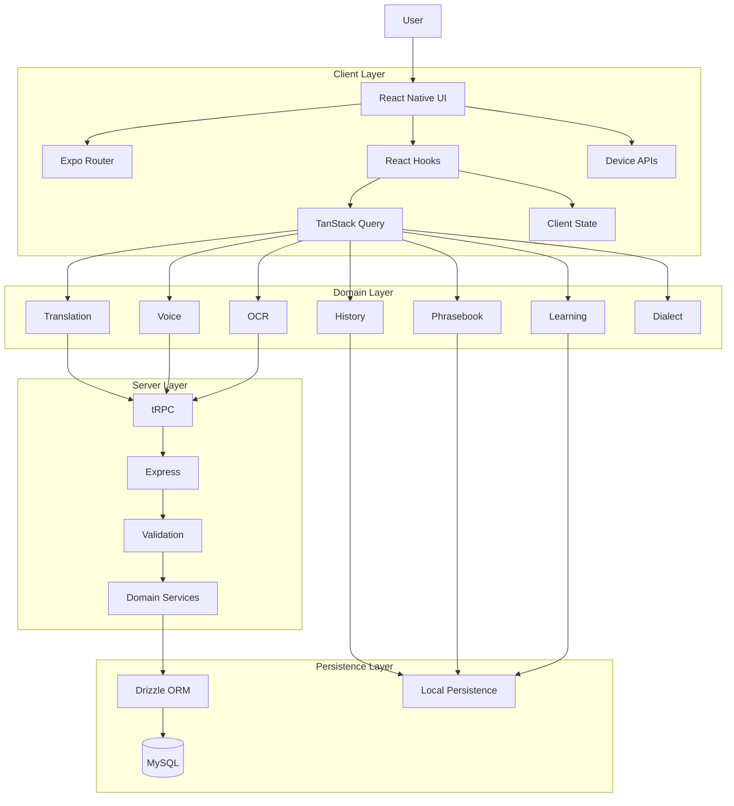

---

# 7. High-Level Architecture

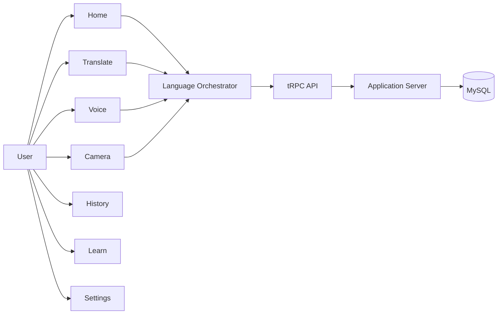

---

# 8. Mobile Application Architecture

The application is designed around Expo and React Native.

Primary technologies include:

* Expo
* React Native
* React
* TypeScript
* Expo Router
* React Navigation
* NativeWind
* React Native Gesture Handler
* React Native Reanimated
* React Native Safe Area Context
* TanStack Query

The same application architecture is designed to support:

```text
iOS
Android
Web
```

The goal is to maximize shared business logic while allowing platform-specific behavior where native capabilities differ.

---

# 9. Backend Architecture

The server architecture is based around:

```text
Express
+
tRPC
+
TypeScript
+
Zod
+
Drizzle
+
MySQL
```

The server request path is:

```text
Client
  ↓
tRPC Router
  ↓
Validation
  ↓
Service
  ↓
Repository
  ↓
Database
```

Diagram:

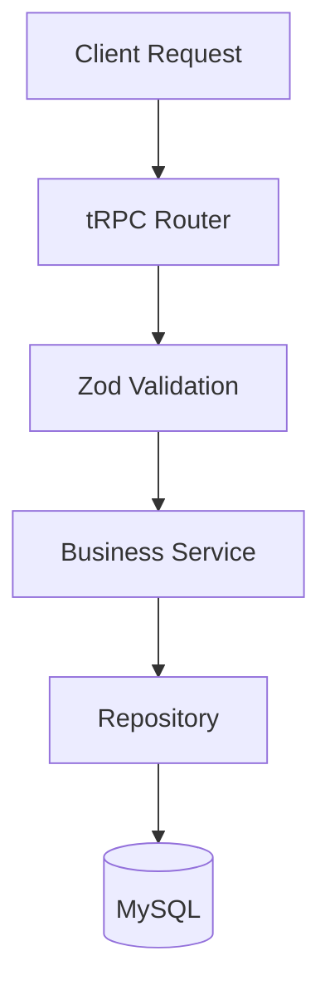

This structure provides clear boundaries and makes individual services easier to test.

---

# 10. Translation Architecture

Translation should be isolated behind a domain service.

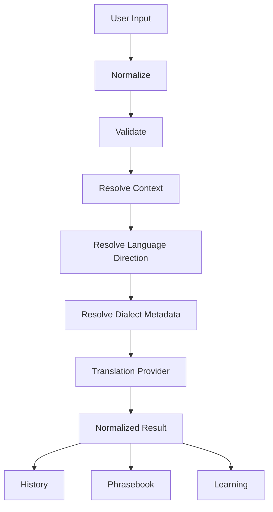

The UI should not know how a translation provider works.

Instead, UI code should call:

```ts
translationService.translate(...)
```

---

# 11. Text Translation

## Text Translation Flow

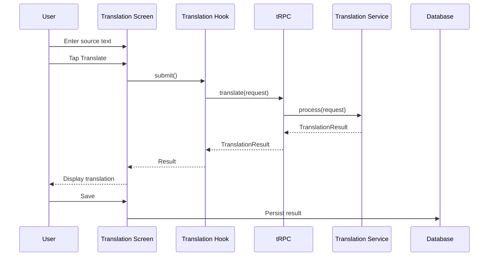

---

## Request Model

```ts
export type TranslationRequest = {
  sourceLanguage: string;
  targetLanguage: string;
  sourceText: string;
  mode?: "text" | "voice" | "camera";
  dialect?: string;
};
```

---

## Result Model

```ts
export type TranslationResult = {
  id?: string;
  sourceLanguage: string;
  targetLanguage: string;
  sourceText: string;
  translatedText: string;
  mode?: "text" | "voice" | "camera";
  dialect?: string;
  provider?: string;
  createdAt?: string;
};
```

---

# 12. Voice Translation

Voice is a multimodal extension of translation.

```text
User Speech
    ↓
Microphone
    ↓
Audio
    ↓
Speech-to-Text
    ↓
Transcript
    ↓
Translation
    ↓
Translated Text
    ↓
Text-to-Speech
    ↓
User
```

---

## Voice State Model

```ts
export type VoiceState =
  | "idle"
  | "requesting-permission"
  | "recording"
  | "processing"
  | "transcribed"
  | "translating"
  | "completed"
  | "cancelled"
  | "error";
```

---

## Voice Architecture

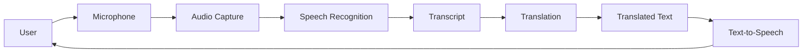

---

## Permission Handling

Every voice interaction should account for:

```text
Permission Requested
Permission Granted
Permission Denied
Permission Restricted
Permission Restored
```

The application should never crash because microphone permission was denied.

When voice is unavailable:

```text
Voice unavailable
        ↓
Explain permission requirement
        ↓
Offer Text Translation
```

---

# 13. Camera and OCR

Camera translation extends the application into physical-world language understanding.

Potential use cases:

* signs
* menus
* labels
* documents
* printed notes
* packaging
* instructions
* screenshots

---

## Camera Pipeline

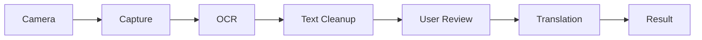

---

## OCR Review

OCR should not automatically be treated as perfect.

Possible OCR problems include:

* poor lighting
* low resolution
* stylized type
* handwritten text
* rotated text
* curved text
* overlapping text

Therefore:

```text
OCR
 ↓
Detected Text
 ↓
Human Review
 ↓
Translation
```

is preferable to silently translating unverified OCR output.

---

# 14. Translation History

History makes translation persistent.

A history record can contain:

```ts
export type TranslationHistoryItem = {
  id: string;
  sourceLanguage: string;
  targetLanguage: string;
  sourceText: string;
  translatedText: string;
  mode: "text" | "voice" | "camera";
  dialect?: string;
  favorite?: boolean;
  createdAt: string;
};
```

---

## History Actions

A history item can support:

```text
Open
Copy
Speak
Share
Favorite
Save as Phrase
Translate Again
Delete
```

---

## History Architecture

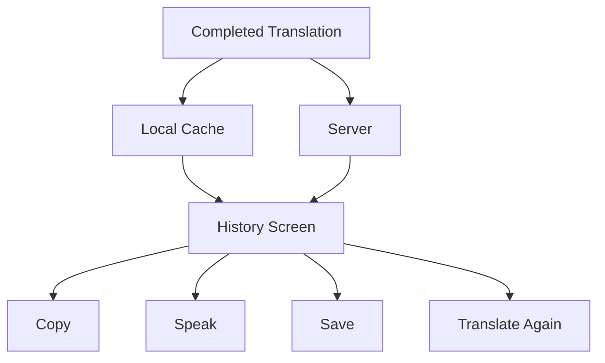

---

# 15. Phrasebook

The phrasebook converts temporary translations into reusable communication assets.

Potential phrase categories:

```text
Greetings
Travel
Food
Shopping
Transportation
School
Work
Family
Healthcare
Daily Life
Emergency
Social
```

---

## Phrase Model

```ts
export type Phrase = {
  id: string;
  sourceText: string;
  translatedText: string;
  sourceLanguage: string;
  targetLanguage: string;
  category: string;
  favorite: boolean;
  practiced: boolean;
  createdAt: string;
};
```

---

## Phrase Lifecycle

```text
Translation
     ↓
Save
     ↓
Categorize
     ↓
Phrasebook
     ↓
Practice
     ↓
Reuse
```

---

# 16. Learning Architecture

KAMRAN can transform translation activity into language-learning content.

A learning item can be based on:

* saved phrases
* frequently translated terms
* frequently repeated phrases
* user corrections
* favorite translations
* manually created study items

---

## Learning Pipeline

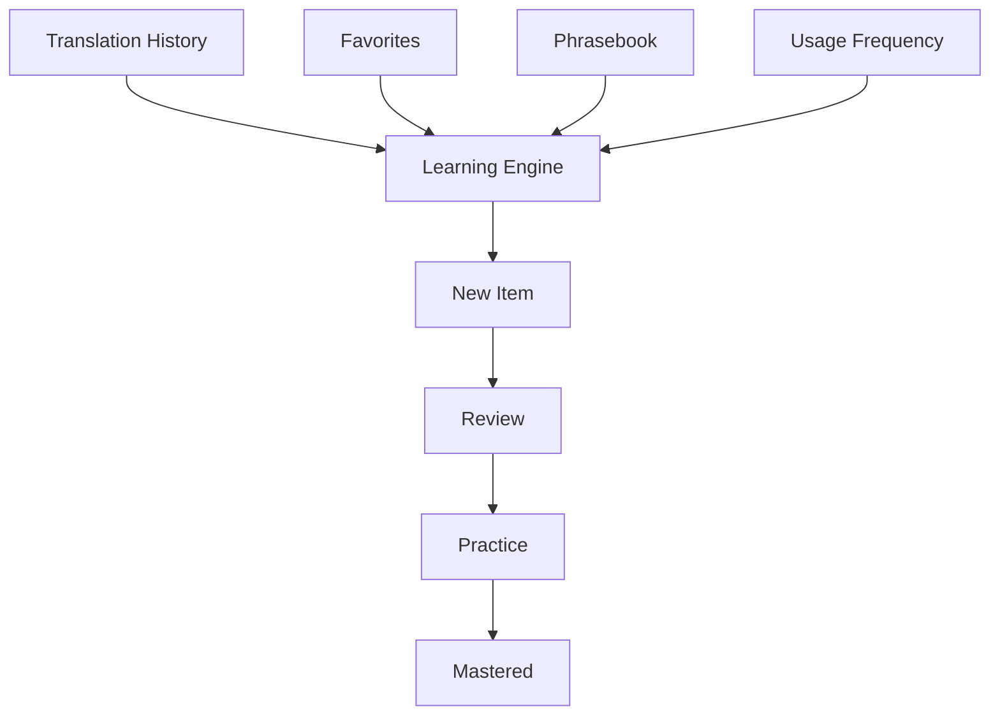

---

## Learning State

```ts
export type MasteryLevel =
  | "new"
  | "seen"
  | "learning"
  | "practiced"
  | "mastered";
```

---

## Future Learning Features

Potential future capabilities:

* daily review
* flashcards
* listening exercises
* pronunciation exercises
* phrase completion
* multiple-choice questions
* spaced repetition
* pronunciation scoring
* context drills
* adaptive difficulty

---

# 17. Dialect Architecture

Dialect support should be designed honestly and modularly.

Safe current capabilities can include:

```text
Dialect Selection
Dialect Metadata
Dialect Labels
Dialect Preferences
Dialect-Specific Phrase Categories
```

Future capabilities can include:

```text
Automatic Dialect Detection
Dialect-Aware Translation
Dialect-Specific Speech Recognition
Dialect-Preserving Translation
Dialect-Specific Learning
```

---

## Dialect Model

```ts
export type DialectMetadata = {
  language: "ug" | "zh";
  code: string;
  displayName: string;
  region?: string;
  description?: string;
};
```

---

## Dialect Architecture

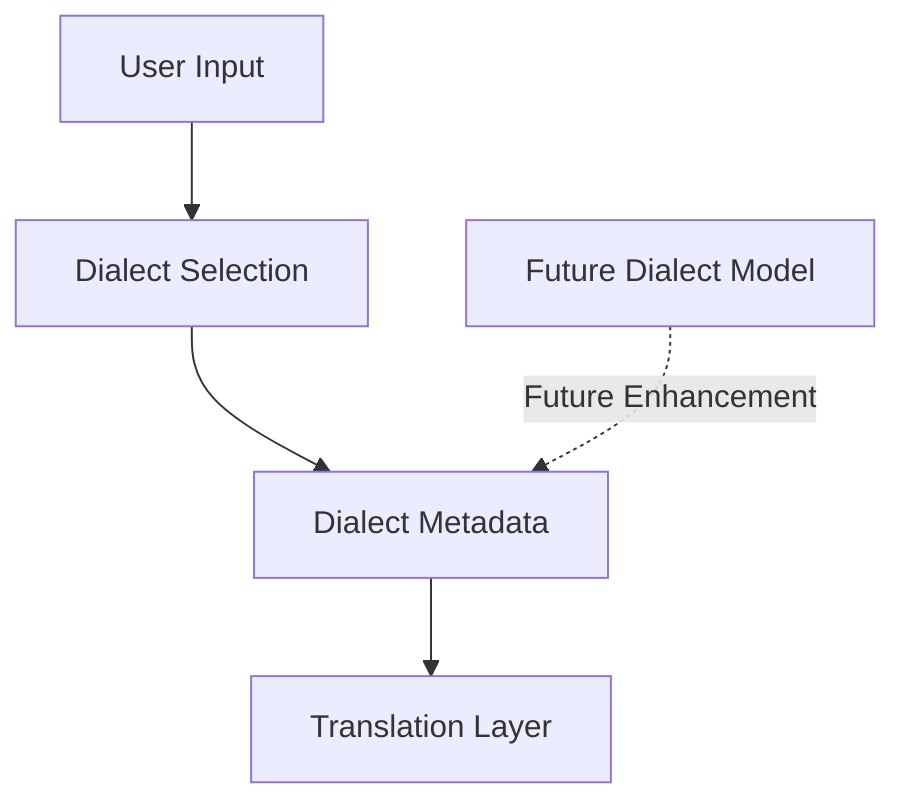

The important architectural rule is:

> UI metadata must not be mistaken for a production machine-learning capability.

---

# 18. RTL and Internationalization

Uyghur can require right-to-left presentation.

A multilingual application may render:

```text
Uyghur       RTL
Chinese      LTR
English      LTR
Numbers      Context dependent
URLs         LTR
Identifiers  LTR
```

The UI should therefore support semantic direction.

```ts
export type TextDirection =
  | "ltr"
  | "rtl"
  | "auto";
```

---

## RTL Architecture

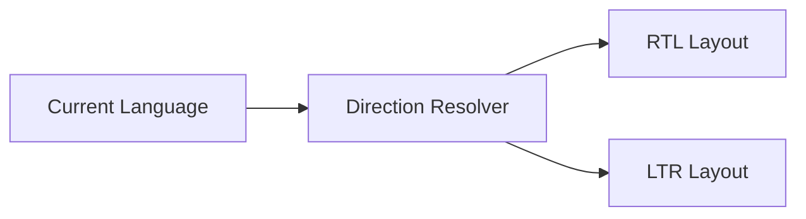

RTL testing should verify:

* text alignment
* icon positioning
* arrow direction
* language selectors
* input fields
* result cards
* navigation
* animation direction
* accessibility labels

---

# 19. Accessibility

Accessibility is a core engineering requirement.

Important areas include:

* touch target size
* readable typography
* contrast
* screen-reader support
* semantic labels
* focus behavior
* empty states
* loading states
* error states
* keyboard behavior
* non-color-only state communication

Example accessible states:

```text
"Translating"

"Translation completed"

"Translation failed"

"Microphone permission required"

"Camera permission required"
```

---

## Accessibility Checklist

```text
[ ] Buttons have accessible labels
[ ] Icons have semantic meaning
[ ] Touch targets are sufficiently large
[ ] Error states are announced
[ ] Loading states are understandable
[ ] RTL layouts are tested
[ ] Dynamic text size is supported
[ ] Contrast is acceptable
[ ] Actions do not depend solely on color
```

---

# 20. Design System

KAMRAN can use a warm editorial visual language.

Suggested semantic tokens:

```ts
export const colors = {
  background: "#FAF7F1",
  surface: "#FFFFFF",
  textPrimary: "#1E2421",
  textMuted: "#77736D",
  primary: "#D9773F",
  secondary: "#2D7C74",
  border: "#E9E1D7",
  success: "#4D8A67",
};
```

---

## Design Philosophy

The interface should feel:

```text
Warm
Accessible
Human
Focused
Quiet
Trustworthy
Readable
```

The translation experience should prioritize clarity over visual complexity.

---

## Component Design

Examples:

```text
LanguageSelector
TranslationCard
TextInputCard
SwapButton
TranslateButton
VoiceButton
CameraButton
HistoryItem
PhraseCard
LearningCard
LoadingState
ErrorState
EmptyState
```

---

# 21. Navigation Architecture

Primary navigation:

```text
Home
Translate
History
Learn
Settings
```

Conceptual navigation tree:

```text
Root
│
├── Home
│   ├── Quick Translate
│   ├── Voice
│   ├── Camera
│   ├── Recent
│   └── Learn Preview
│
├── Translate
│   ├── Text
│   ├── Voice
│   └── Camera
│
├── History
│   ├── All
│   ├── Favorites
│   └── Search
│
├── Learn
│   ├── Vocabulary
│   ├── Phrases
│   ├── Review
│   └── Practice
│
└── Settings
    ├── Languages
    ├── Dialects
    ├── Speech
    ├── Offline
    ├── Appearance
    └── About
```

---

# 22. State Management

KAMRAN should distinguish several kinds of state.

## UI State

```text
modalVisible
selectedTab
inputFocused
showHistory
```

## Server State

```text
translationResult
historyItems
phrasebookItems
learningData
```

## Device State

```text
cameraPermission
microphonePermission
networkState
deviceCapabilities
```

## Persistent State

```text
languagePreference
dialectPreference
appearancePreference
offlineSettings
```

TanStack Query is suitable for server-state synchronization while local state handles transient interface behavior.

---

# 23. Data Model

Conceptual relational model:

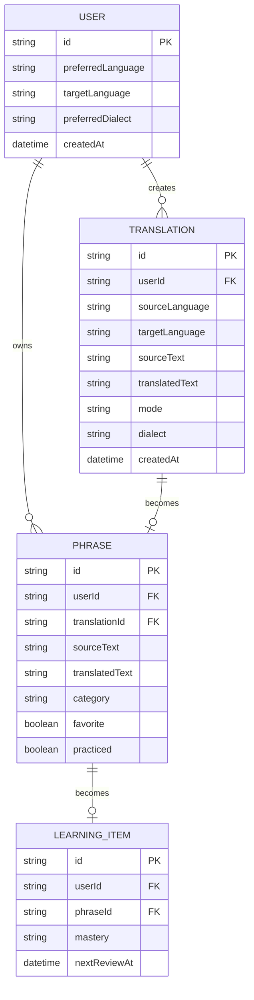

---

# 24. API Architecture

API interfaces should remain domain-oriented.

## Translation

```ts
interface TranslationService {
  translate(
    request: TranslationRequest
  ): Promise<TranslationResult>;
}
```

## OCR

```ts
interface OcrService {
  recognize(
    image: ImageInput
  ): Promise<OcrResult>;
}
```

## Speech Recognition

```ts
interface SpeechService {
  transcribe(
    audio: AudioInput
  ): Promise<string>;
}
```

## Speech Playback

```ts
interface SpeechPlaybackService {
  speak(
    text: string,
    language: string
  ): Promise<void>;
}
```

## History

```ts
interface HistoryRepository {
  create(
    record: TranslationHistoryItem
  ): Promise<TranslationHistoryItem>;

  list(
    userId: string
  ): Promise<TranslationHistoryItem[]>;

  delete(
    id: string
  ): Promise<void>;
}
```

---

# 25. Async Processing

Translation requests are asynchronous.

Recommended state model:

```text
idle
 ↓
validating
 ↓
loading
 ↓
success
```

Failure path:

```text
idle
 ↓
validating
 ↓
loading
 ↓
error
 ↓
retry
```

Generic implementation:

```ts
export type AsyncState<T> =
  | { status: "idle" }
  | { status: "loading" }
  | { status: "success"; data: T }
  | { status: "error"; error: Error };
```

---

## Request Cancellation

If the user changes the input while an older request is running:

```text
Request A
   ↓
User edits text
   ↓
Request B
   ↓
Request A is stale
   ↓
Cancel Request A
```

This avoids race conditions.

---

# 26. Offline Architecture

Offline behavior should be deliberate.

## Offline UI

The application should still launch.

## Offline History

Cached history should remain readable.

## Offline Phrasebook

Saved phrases should remain accessible.

## Offline Learning

Previously downloaded learning content can remain available.

## Offline Translation

A local model or language pack can eventually support true offline translation.

---

## Offline Architecture

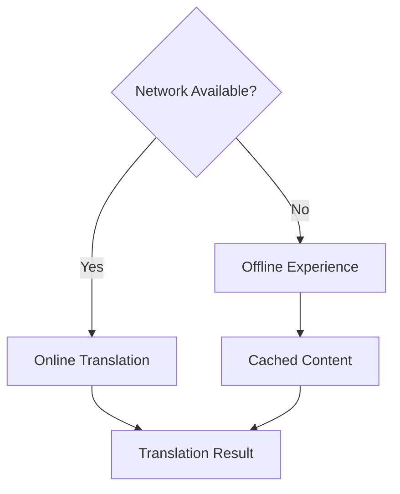

---

# 27. Security and Privacy

Translation input can contain personal information.

Important principles:

## Minimize storage

Only retain data required for product functionality.

## Protect secrets

Private API keys must never be shipped inside client bundles.

## Avoid sensitive analytics

Do not automatically send raw translation text into analytics platforms.

## Permission minimization

Request device permissions only when needed.

## User controls

Provide clear ways to delete:

* history
* saved phrases
* cached data
* preferences

---

## Secure Logging

Avoid:

```ts
console.log(sourceText);
```

Prefer:

```ts
logger.info({
  event: "translation_completed",
  sourceLanguage,
  targetLanguage,
  mode,
  durationMs,
});
```

---

# 28. Environment Configuration

Separate configuration into:

```text
Public Client Configuration
Server Configuration
Build Configuration
```

Never expose:

```text
DATABASE_PASSWORD
PRIVATE_API_KEY
JWT_SECRET
SERVICE_CREDENTIALS
```

inside the mobile application.

Example:

```text
.env
.env.local
.env.production
```

Sensitive environment files should remain excluded from version control.

---

# 29. Installation

## Requirements

Recommended environment:

```text
Node.js
pnpm
Git
Expo development tools
Xcode for iOS
Android Studio for Android
```

Clone the project:

```bash
git clone https://github.com/lucylow/KAMRAN-Uygher-Translation.git
cd KAMRAN-Uygher-Translation
```

Install dependencies:

```bash
pnpm install
```

---

# 30. Local Development

Start development:

```bash
pnpm dev
```

Typical architecture:

```text
Developer Machine
       │
       ├── Expo / Metro
       │
       ├── Application Server
       │
       ├── Database
       │
       └── Device / Simulator
```

---

# 31. Running the Application

## Development

```bash
pnpm dev
```

## Android

```bash
pnpm android
```

## iOS

```bash
pnpm ios
```

## QR Workflow

```bash
pnpm qr
```

---

# 32. Testing

The project uses Vitest-oriented testing.

Run:

```bash
pnpm test
```

Testing layers should include:

```text
Unit Tests
Integration Tests
Service Tests
Database Tests
Translation Tests
UI Tests
```

---

## Example Translation Test

```ts
describe("translation service", () => {
  it("normalizes translation responses", async () => {
    const result = await service.translate({
      sourceLanguage: "ug",
      targetLanguage: "zh",
      sourceText: "example",
    });

    expect(result.sourceLanguage).toBe("ug");
    expect(result.targetLanguage).toBe("zh");
    expect(result.translatedText).toBeTruthy();
  });
});
```

---

# 33. Type Safety

TypeScript should be used throughout the application.

Important shared types include:

```ts
LanguageCode
TranslationMode
TranslationRequest
TranslationResult
TranslationHistoryItem
Phrase
LearningItem
DialectMetadata
```

Example:

```ts
export type LanguageCode =
  | "ug"
  | "zh"
  | "en";

export type TranslationMode =
  | "text"
  | "voice"
  | "camera";
```

Strong typing reduces errors across:

```text
UI
Hooks
Services
API
Persistence
```

---

# 34. Linting and Formatting

Lint:

```bash
pnpm lint
```

Type validation:

```bash
pnpm check
```

Formatting:

```bash
pnpm format
```

Recommended CI flow:

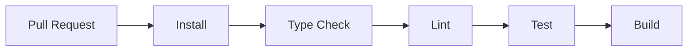

---

# 35. Database Development

The repository uses Drizzle ORM with MySQL support.

Database workflow:

```text
Schema
   ↓
Drizzle
   ↓
Migration
   ↓
MySQL
```

Example command:

```bash
pnpm db:push
```

For production, schema modifications should be tracked explicitly through migration workflows.

---

# 36. Production Build Architecture

Build environments can include:

```text
Development
Preview
Production
```

Flow:

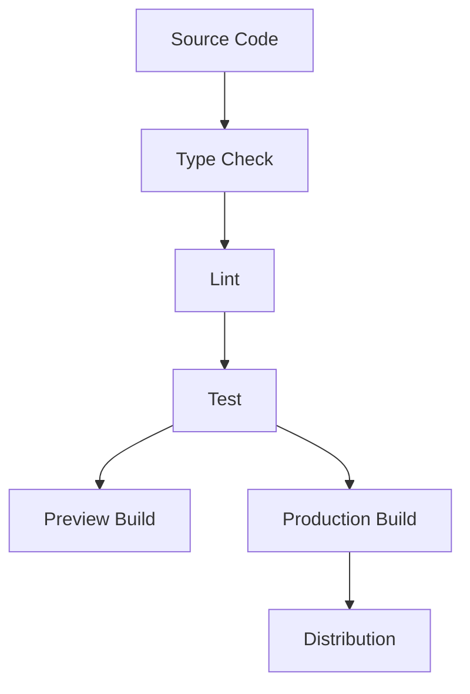

---

# 37. EAS Deployment

Preview build:

```bash
pnpm eas:build:preview
```

Production build:

```bash
pnpm eas:build:production
```

Production submission:

```bash
pnpm eas:submit:production
```

Recommended pre-release commands:

```bash
pnpm check
pnpm lint
pnpm test
```

---

# 38. Release Engineering

Professional release lifecycle:

```text
Feature Complete
      ↓
Code Review
      ↓
Type Check
      ↓
Lint
      ↓
Tests
      ↓
Preview Build
      ↓
Device QA
      ↓
Production Build
      ↓
Store Submission
```

Track:

```text
Version
Build Number
Git SHA
Environment
Release Notes
```

---

# 39. Repository Structure

The project is organized around several important directories:

```text
KAMRAN-Uygher-Translation/
│
├── app/
├── assets/
├── components/
├── constants/
├── distribution/
├── docs/
├── drizzle/
├── hooks/
├── lib/
├── media/
├── mobile-mockup-build/
├── scripts/
├── server/
├── shared/
├── src/
├── tests/
│
├── app.config.ts
├── eas.json
├── babel.config.js
├── drizzle.config.ts
├── eslint.config.mjs
├── global.css
├── package.json
├── tsconfig.json
├── design.md
├── design-reference-findings.md
├── dialect-extension-findings.md
├── AGENTS.md
└── CLAUDE.md
```

---

# 40. Frontend Architecture

The frontend should be organized around reusable domain components.

Suggested components:

```text
TranslationCard
LanguageSelector
LanguageSwapButton
TextInputCard
TranslateButton
VoiceButton
CameraButton
HistoryItem
PhraseCard
LearningCard
LoadingState
ErrorState
EmptyState
```

---

## Hooks

Potential hooks:

```text
useTranslation
useHistory
usePhrasebook
useLearning
useSpeech
useCamera
usePermissions
useDialect
useOffline
```

---

## Recommended Component Pattern

Avoid putting all business logic inside a screen.

Avoid:

```tsx
function TranslateScreen() {
  // Huge amount of API logic
  // validation
  // persistence
  // UI
}
```

Prefer:

```tsx
function TranslateScreen() {
  const translation = useTranslation();

  return (
    <TranslationView
      {...translation}
    />
  );
}
```

---

# 41. Backend Engineering

The preferred server architecture is:

```text
Router
   ↓
Validation
   ↓
Service
   ↓
Repository
   ↓
Database
```

Each layer has one responsibility.

## Router

Handles transport.

## Validation

Checks external input.

## Service

Handles business logic.

## Repository

Handles persistence.

## Database

Stores durable data.

---

# 42. Translation Quality

Translation quality is multidimensional.

Important considerations:

## Meaning

Does the result preserve the intent?

## Fluency

Does it sound natural?

## Terminology

Are important terms consistent?

## Context

Does surrounding information change the meaning?

## Register

Is the tone appropriate?

## Directionality

Does Uyghur render correctly?

## User Correction

Does the user repeatedly modify the output?

Potential quality signals:

```text
Latency
Error Rate
Retry Rate
Correction Rate
Result Abandonment
Save Rate
```

---

# 43. AI Architecture

AI functionality should exist behind abstraction layers.

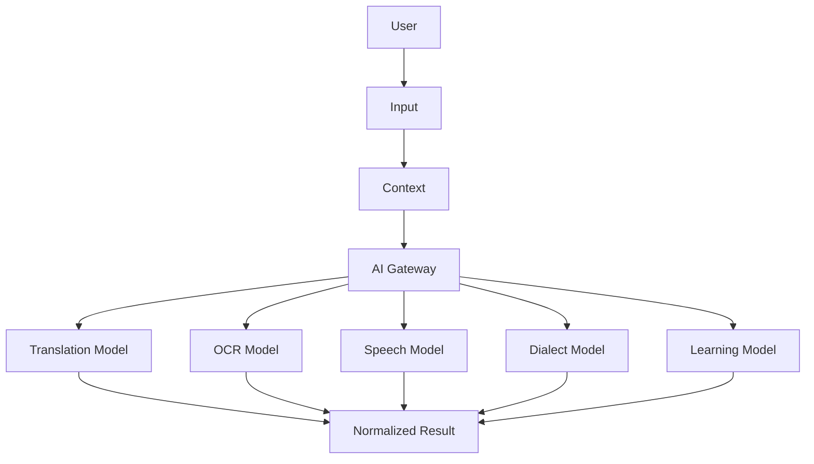

---

## AI Gateway Principle

The UI should not directly depend on a specific model vendor.

Instead:

```text
UI
 ↓
AI Service
 ↓
Provider Adapter
 ↓
Model
```

This makes providers replaceable.

---

# 44. Performance Engineering

Performance priorities include:

## Fast first interaction

The user should be able to begin typing immediately.

## Request debouncing

Avoid unnecessary requests.

## Request cancellation

Cancel stale requests.

## Memoization

Avoid unnecessary renders.

## Virtualized lists

Use efficient lists for history.

## Image optimization

Reduce camera image sizes before network upload when possible.

---

## Translation Request Optimization

```text
Input Changed
    ↓
Debounce
    ↓
Validate
    ↓
Request
    ↓
Cancel Previous Request If Necessary
    ↓
Display Latest Result
```

---

# 45. Observability

Useful metrics include:

```text
translation_request_count
translation_success_count
translation_error_count
translation_latency_ms
ocr_success_rate
voice_success_rate
permission_denial_rate
offline_usage_rate
history_save_rate
phrase_save_rate
learning_completion_rate
```

Observability should avoid unnecessary collection of raw user translation content.

---

# 46. Error Handling

The application should define clear recovery behavior.

## Network Error

```text
Network Error
     ↓
Preserve Input
     ↓
Offer Retry
     ↓
Offer Offline Content
```

## Translation Timeout

```text
Timeout
   ↓
Stop Loading
   ↓
Preserve Input
   ↓
Retry
```

## OCR Failure

```text
OCR Failure
   ↓
Explain
   ↓
Retake
   ↓
Manual Input
```

## Permission Failure

```text
Permission Denied
   ↓
Explain
   ↓
Open Settings / Retry
   ↓
Alternative Workflow
```

---

# 47. User Journey

## First-Time User

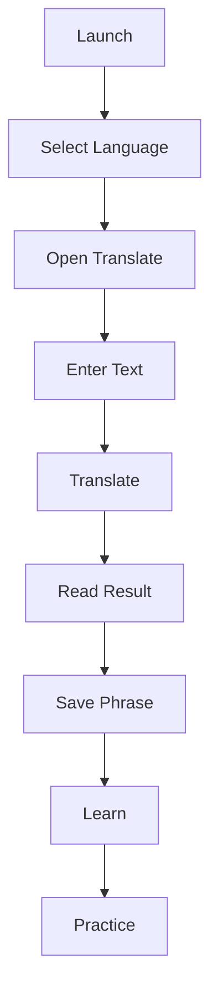

---

## Returning User

```text
Open App
   ↓
Recent Translation
   ↓
Choose Action
   ├── Text
   ├── Voice
   ├── Camera
   ├── History
   └── Learn
```

---

# 48. State Machines

## Translation State Machine

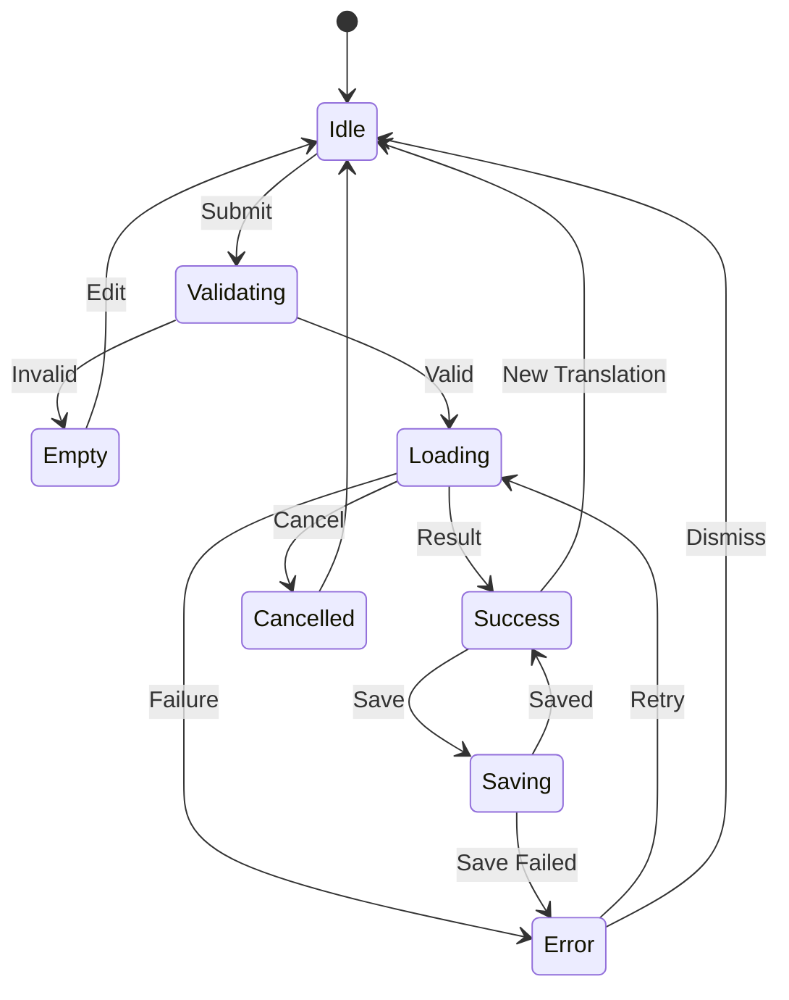

---

## Voice State Machine

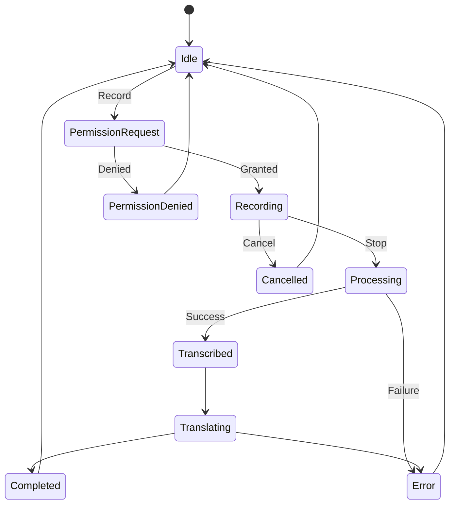

---

# 49. Sequence Diagrams

## Translation

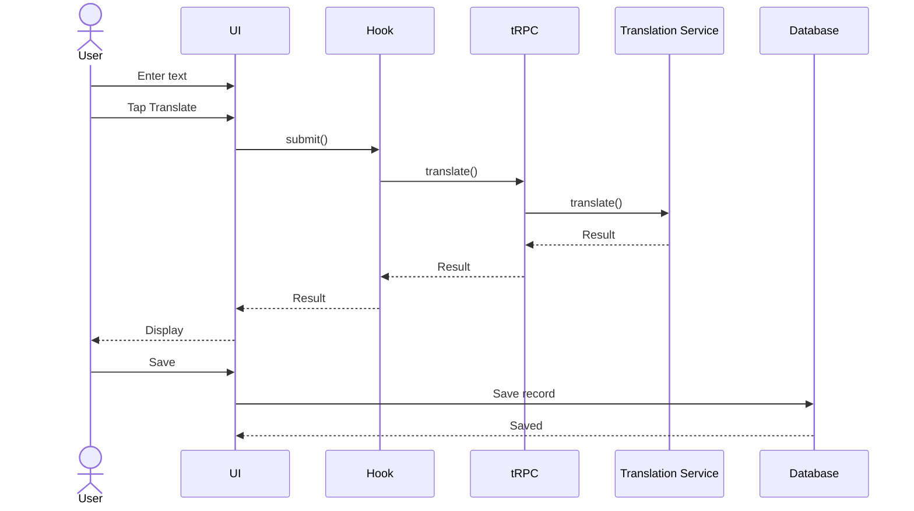

---

## Camera

```mermaid
sequenceDiagram

    actor User
    participant Camera
    participant OCR
    participant Review
    participant Translation

    User->>Camera: Open
    Camera-->>User: Preview
    User->>Camera: Capture
    Camera->>OCR: Process Image
    OCR-->>Review: Detected Text
    User->>Review: Confirm
    Review->>Translation: Translate
    Translation-->>User: Result
```

---

## Voice

```mermaid
sequenceDiagram

    actor User
    participant Mic
    participant STT
    participant Translation
    participant TTS

    User->>Mic: Start Recording
    User->>Mic: Stop Recording
    Mic->>STT: Audio
    STT-->>User: Transcript
    User->>Translation: Translate
    Translation-->>User: Result
    User->>TTS: Play
    TTS-->>User: Spoken Translation
```

---

# 50. Technical Decisions

## ADR-001 — Expo

Expo provides a practical cross-platform foundation.

Reasons include:

* cross-platform runtime
* native integration
* EAS support
* simplified development
* routing support

---

## ADR-002 — TypeScript

TypeScript is used to create strong contracts across:

```text
UI
Services
API
Database
```

---

## ADR-003 — tRPC

tRPC provides typed communication between client and server.

---

## ADR-004 — Drizzle

Drizzle provides strongly typed database interactions.

---

## ADR-005 — Provider Abstraction

Translation providers should remain behind a common service boundary.

This prevents provider changes from forcing a complete frontend rewrite.

---

# 51. Development Roadmap

## Phase 1 — Core

```text
Text Translation
Language Switching
History
Copy
Share
```

## Phase 2 — Multimodal

```text
Voice
Speech Playback
Camera
OCR
```

## Phase 3 — Learning

```text
Phrasebook
Flashcards
Vocabulary
Practice
```

## Phase 4 — Offline

```text
Cached History
Offline Phrasebook
Offline Learning
Language Packs
```

## Phase 5 — Intelligence

```text
Context
Dialect
Adaptive Learning
Smart Suggestions
```

## Phase 6 — Scale

```text
Provider Failover
Monitoring
Analytics
Performance
Automated QA
```

---

# 52. Contribution Guide

Contributions should preserve:

```text
Type Safety
Accessibility
Privacy
Performance
Cross-Platform Support
Clear Domain Boundaries
```

---

## Contribution Workflow

```text
Issue
 ↓
Design
 ↓
Implementation
 ↓
Tests
 ↓
Type Check
 ↓
Lint
 ↓
Review
 ↓
Merge
```

---

## Branch Naming

```text
feature/text-translation
feature/voice
feature/camera
feature/ocr
feature/phrasebook
feature/learning
feature/dialect
fix/history
fix/permissions
refactor/translation-service
```

---

# 53. Engineering Standards

## Rule 1 — Preserve User Input

Never erase entered text because an API request fails.

## Rule 2 — Keep Screens Small

Move business logic into hooks and services.

## Rule 3 — Validate External Input

All server-facing inputs should be validated.

## Rule 4 — Handle Errors

Every asynchronous feature requires an error state.

## Rule 5 — Handle Loading

Every asynchronous feature requires visible loading behavior.

## Rule 6 — Support Recovery

Every failure should provide a useful next step.

## Rule 7 — Keep Providers Abstract

Provider-specific code belongs behind service boundaries.

## Rule 8 — Protect User Content

Avoid unnecessary logging or analytics collection.

---

# 54. Future Features

## Conversation Mode

Two-way communication:

```mermaid
flowchart LR

    PERSON_A[Person A]
    SPEECH_A[Speech A]
    TRANSLATE_A[Translate A]
    OUTPUT_A[Output A]

    PERSON_B[Person B]
    SPEECH_B[Speech B]
    TRANSLATE_B[Translate B]
    OUTPUT_B[Output B]

    PERSON_A --> SPEECH_A
    SPEECH_A --> TRANSLATE_A
    TRANSLATE_A --> OUTPUT_A
    OUTPUT_A --> PERSON_B

    PERSON_B --> SPEECH_B
    SPEECH_B --> TRANSLATE_B
    TRANSLATE_B --> OUTPUT_B
    OUTPUT_B --> PERSON_A
```

---

## Smart Suggestions

```text
Current Input
    ↓
Language Context
    ↓
Phrase Search
    ↓
Suggested Phrases
    ↓
One-Tap Insert
```

---

## Context-Aware Translation

```ts
export type TranslationContext = {
  locationType?: "restaurant" | "travel" | "school" | "work";
  formality?: "casual" | "neutral" | "formal";
  conversationMode?: boolean;
};
```

---

## Adaptive Learning

Future learning could use:

```text
Translation Frequency
Favorite Phrases
Practice History
Corrections
Mastery
```

to suggest what the user should learn next.

---

# 55. Example Workflows

## Workflow 1 — Quick Text Translation

```text
Open App
  ↓
Translate
  ↓
Select Uyghur → Chinese
  ↓
Enter Text
  ↓
Translate
  ↓
Read Result
  ↓
Copy
```

---

## Workflow 2 — Save a Phrase

```text
Translate
   ↓
Result
   ↓
Save
   ↓
Category
   ↓
Phrasebook
```

---

## Workflow 3 — Camera Translation

```text
Open Camera
   ↓
Capture Text
   ↓
OCR
   ↓
Review
   ↓
Translate
   ↓
Result
```

---

## Workflow 4 — Voice Translation

```text
Voice
   ↓
Permission
   ↓
Record
   ↓
Stop
   ↓
Speech Recognition
   ↓
Translation
   ↓
Playback
```

---

# 56. Troubleshooting

## Dependency Installation

Check:

```bash
node --version
pnpm --version
```

Then:

```bash
rm -rf node_modules
pnpm install
```

---

## Metro Cache

```bash
npx expo start -c
```

---

## iOS Problems

Verify:

```text
Xcode
CocoaPods
Node
pnpm
Expo packages
```

---

## Android Problems

Verify:

```text
Android Studio
Android SDK
emulator
ADB
Expo configuration
```

---

## Camera Problems

Check:

```text
Camera permission
Native build configuration
Device permissions
```

---

## Microphone Problems

Check:

```text
Microphone permission
Audio configuration
Physical device
System settings
```

---

## Translation Problems

Check:

```text
Network
Environment variables
Server
API route
Provider configuration
Validation
```

Always preserve source text so the user does not lose their work.

---

# 57. FAQ

## What is KAMRAN?

KAMRAN is a multilingual communication companion centered around Uyghur ↔ Chinese translation.

## Is it only a translation application?

No.

The architecture includes translation, history, phrasebook, learning, voice, camera/OCR, speech, and offline-ready workflows.

## What platforms are targeted?

```text
iOS
Android
Web
```

## Does the app support RTL?

The architecture is designed to support Uyghur right-to-left content.

## Does it support voice?

The application architecture includes voice input and speech output workflows.

## Does it support camera translation?

The project includes camera/OCR-oriented workflows.

## Does it support learning?

Yes. Translation results can feed phrasebook and learning experiences.

## Does it support dialects?

The project architecture provides dialect metadata and extension points for future dialect-specific intelligence.

## Does it use TypeScript?

Yes.

## Does it have a backend?

The repository includes server-side architecture based around TypeScript, Express, tRPC, validation, Drizzle, and MySQL support.

---

# 58. Project Philosophy

KAMRAN is built around several principles.

## Translation is a workflow

Translation should lead to communication.

## Language is contextual

Meaning depends on context.

## Learning is part of translation

Users should be able to turn translations into reusable knowledge.

## Accessibility is foundational

Accessibility should be included throughout the application.

## Privacy matters

Translation input can contain sensitive information.

## Offline capability matters

Useful language tools should degrade gracefully when connectivity disappears.

## AI should remain modular

AI providers and models will evolve.

## Capabilities should be documented honestly

A future architecture should not be presented as an already-completed production capability.

---

# 59. Complete Architecture Diagram

```mermaid
flowchart TB

    USER[User]

    subgraph APP["KAMRAN Application"]
        HOME[Home]
        TRANSLATE[Translate]
        VOICE[Voice]
        CAMERA[Camera]
        HISTORY[History]
        PHRASEBOOK[Phrasebook]
        LEARN[Learn]
        SETTINGS[Settings]
    end

    subgraph DOMAIN["Language Domain"]
        TL[Translation]
        STT[Speech-to-Text]
        TTS[Text-to-Speech]
        OCR[OCR]
        DIALECT[Dialect Metadata]
        LEARNING[Learning Engine]
        CONTEXT[Context Engine]
    end

    subgraph CLIENT["Client Infrastructure"]
        ROUTER[Expo Router]
        HOOKS[Hooks]
        QUERY[TanStack Query]
        STATE[Client State]
        DEVICE[Device APIs]
        CACHE[Local Cache]
    end

    subgraph BACKEND["Backend Infrastructure"]
        TRPC[tRPC]
        EXPRESS[Express]
        VALIDATION[Zod]
        SERVICES[Domain Services]
    end

    subgraph STORAGE["Persistence"]
        DRIZZLE[Drizzle ORM]
        MYSQL[(MySQL)]
    end

    USER --> HOME
    USER --> TRANSLATE
    USER --> VOICE
    USER --> CAMERA
    USER --> HISTORY
    USER --> PHRASEBOOK
    USER --> LEARN
    USER --> SETTINGS

    HOME --> ROUTER
    TRANSLATE --> ROUTER
    VOICE --> ROUTER
    CAMERA --> ROUTER
    HISTORY --> ROUTER
    PHRASEBOOK --> ROUTER
    LEARN --> ROUTER
    SETTINGS --> ROUTER

    ROUTER --> HOOKS
    HOOKS --> QUERY
    HOOKS --> STATE
    HOOKS --> DEVICE

    QUERY --> TL
    QUERY --> STT
    QUERY --> TTS
    QUERY --> OCR
    QUERY --> LEARNING
    QUERY --> CONTEXT
    QUERY --> DIALECT

    HISTORY --> CACHE
    PHRASEBOOK --> CACHE
    LEARN --> CACHE

    TL --> TRPC
    STT --> TRPC
    OCR --> TRPC
    LEARNING --> TRPC

    TRPC --> EXPRESS
    EXPRESS --> VALIDATION
    VALIDATION --> SERVICES

    SERVICES --> DRIZZLE
    DRIZZLE --> MYSQL
```

---

# 60. Final Summary

KAMRAN Translate is designed to evolve from a focused translation application into a broader multilingual communication platform.

The core architecture is:

```text
User Experience
       ↓
Reusable Components
       ↓
Hooks
       ↓
Domain Services
       ↓
Typed API
       ↓
Business Logic
       ↓
Persistence
```

The core product loop is:

```text
Enter
 ↓
Translate
 ↓
Understand
 ↓
Save
 ↓
Practice
 ↓
Reuse
 ↓
Communicate
```

The major capability areas are:

```text
Text Translation
Voice Translation
Camera Translation
OCR
Speech Playback
Translation History
Phrasebook
Learning
Dialect Metadata
RTL Support
Offline Readiness
Future AI
```

The long-term architecture can support:

```text
Conversation Mode
Context-Aware Translation
Smart Phrase Suggestions
Adaptive Learning
Downloadable Language Packs
Offline Translation
Dialect Intelligence
AI-Assisted Learning
Provider Failover
Production Observability
```

The most important architectural principle is separation:

```text
                    KAMRAN
                       │
        ┌──────────────┼──────────────┐
        │              │              │
   Experience       Language       Persistence
        │              │              │
        ▼              ▼              ▼
      React          Services        Database
      Native        Translation       MySQL
        │             Speech
        │              OCR
        │             Learning
        │
        └──────────────┬──────────────┘
                       │
                 Typed Contracts
                       │
                    Backend
```

KAMRAN is therefore positioned as more than a translation interface.

It is an extensible language platform centered around:

```text
Translate.
Understand.
Remember.
Learn.
Communicate.
```

---

# KAMRAN Translate

### Uyghur ↔ Chinese Translation • Voice • Camera • History • Learning • Phrasebook • Offline-Ready Architecture

**Built with Expo + React Native + TypeScript + tRPC + Drizzle**

```text
Translate.
Understand.
Remember.
Learn.
Communicate.
```

```
```
